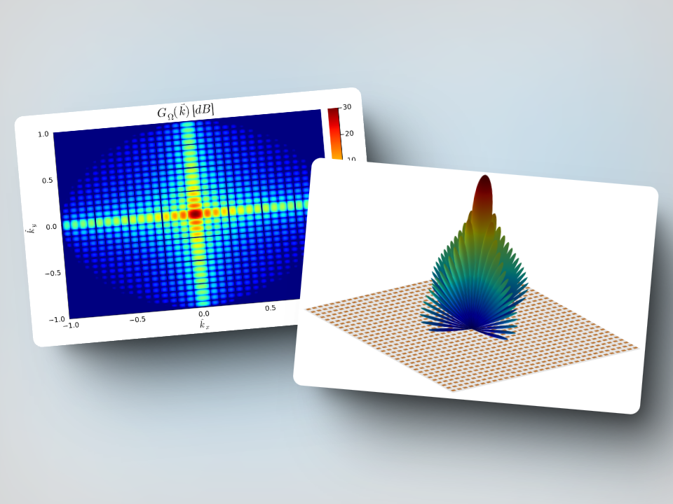

# ArrayRadiation.jl

[](https://erikbuer.github.io/ArrayRadiation.jl/dev/)
[](https://erikbuer.github.io/ArrayRadiation.jl/stable/)


## Features

- Empirical radiation pattern models for common antennas
- Common element weight functions (windows)
- Calculate gain pattern for arbitrary arrays
- Support for regular and irregular arrays



## Installation

```Julia
] add ArrayRadiation
```
